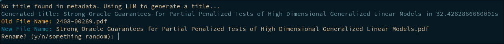

# titler
a shitty python app to help me rename my pdf collection(s) somewhat faster...

Ideally it works by pulling metadata from the pdfs, if that fails it uses the NuExtract model to read the first page of text and suggest a title, if you don't like the suggestion you can type one in yourself.

# requirements:
- a beefy rig
- poetry
- python3.11 (if you're nixxing just use the included `flake.nix`)
- pytorch (if using the local_v1.py) [recommended]
- ollama ( if using it to run the models) [this will eventually replace the local_v1.py]

# usage:


```sh
# In one terminal:
ollama pull llama3:latest
ollama serve # Leave this running..

# In another terminal:
poetry install --no-root
poetry run python main.py --input /home/jer/Documents/go/scrapeThisFor/output/paper.pdf
```

# Notes:
first time usage may be very tedious as models need to download etc.
